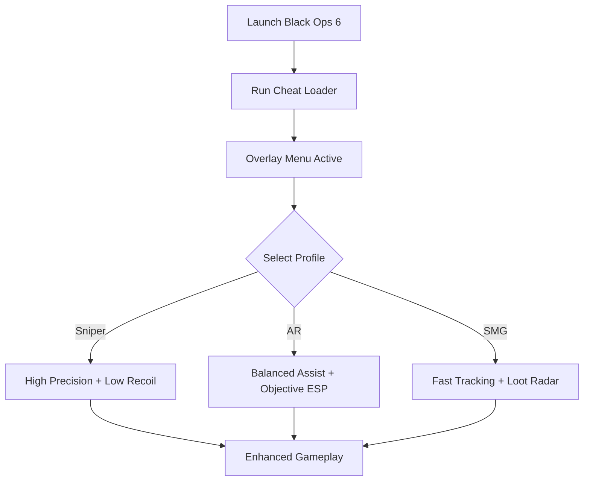

# CoD Black Ops 6 Cheat ⚡

**Call of Duty: Black Ops 6** pushes the franchise further with tactical maps, cinematic campaigns, and a competitive multiplayer grind. Success depends on **accuracy, awareness, and adaptability**—and the **CoD Black Ops 6 Cheat package** delivers exactly that. By combining **aim assist, ESP overlays, and modular configs**, it gives you complete control over your matches.

---

## 🌐 Overview

The Cheat software is an **all-in-one toolkit** for gameplay customization. From precision aim assist and enemy highlights to loot tracking and sensitivity scaling, it lets you create personalized profiles that adapt to every weapon and map. Lightweight and easy to configure, it ensures smooth performance while boosting efficiency.

---

## 🔑 Features

* 🎯 **Aim Assist Module** – Precision lock, recoil control, and sensitivity scaling.
* 👁 **ESP Overlay** – Enemy, loot, and objective highlights with radar view.
* ⚙️ **Custom Profiles** – Presets for snipers, ARs, and SMGs.
* 🔥 **Recoil Compensation** – Reduces vertical/horizontal spray for stability.
* 🎒 **Loot Radar** – Track ammo, weapons, and rare items instantly.
* 🗺 **Objective ESP** – Capture points and mission targets visible at all times.
* ⌨️ **Hotkey Controls** – Switch profiles or toggle cheats instantly.
* 🖥 **Lightweight Loader** – Minimal FPS impact, optimized for Windows 10/11.

---

[](#)
[](#)
[](#)
[](#)

---

## 🖥 Compatibility

| Platform          | Status        | Notes                      |
| ----------------- | ------------- | -------------------------- |
| Windows 10        | ✅ Supported   | Stable overlay builds      |
| Windows 11        | ✅ Optimized   | Best rendering performance |
| Linux (Proton)    | ⚠️ Partial    | Limited functionality      |
| Console (Xbox/PS) | ❌ Unsupported | PC only                    |

[!NOTE]
The cheat package is built for **Windows PC builds of Black Ops 6**.

---

## ⚙️ Setup Guide

1. Download the **CoD Black Ops 6 Cheat** package.

2. Extract into a secure folder.

3. Launch Black Ops 6.

4. Run the loader as administrator:

   ```bash
   bo6_cheat.exe -game bo6.exe -overlay on
   ```

5. Open the menu in-game with `F4`.

6. Configure settings via `cheat.ini`:

   ```ini
   [AimAssist]
   PrecisionLock=True
   RecoilComp=0.7
   SensitivityScale=1.2

   [ESP]
   Enemies=True
   Loot=True
   Objectives=True
   Radar=On

   [Profiles]
   Sniper=PrecisionLock:High, Recoil:Low
   AR=Balanced, Recoil:Medium
   SMG=FastLock, Recoil:High
   ```

7. Switch between profiles with `F1–F3`.

[!IMPORTANT]
Back up configs before updating the cheat to new game patches.

---

## 📊 Cheat Workflow



---

## 🎚 Example Configurations

**Sniper Profile:**

```ini
PrecisionLock=High
RecoilComp=0.5
SensitivityScale=0.9
```

**Assault Rifle Profile:**

```ini
PrecisionLock=Balanced
RecoilComp=0.7
SensitivityScale=1.1
```

**SMG Profile:**

```ini
PrecisionLock=Fast
RecoilComp=0.9
SensitivityScale=1.4
```

[!WARNING]
Aggressive aim assist + ESP clutter may feel unnatural—use moderated settings for ranked play.

---

## ❓ FAQ

**Q: Does it work in ranked multiplayer?**
A: Yes, but configs should be tested in private lobbies first.

**Q: Can I toggle cheats mid-match?**
A: Yes, hotkeys allow instant switching.

**Q: Does this affect FPS?**
A: No, overlay runs lightweight (<5% usage).

**Q: Are updates synced with patches?**
A: Yes, new builds are released after major updates.

**Q: Can I disable everything quickly?**
A: Yes, press the master toggle (`F12`) to disable all features.

---

## 🚀 Final Thoughts

The **CoD Black Ops 6 Cheat** combines **aim assist precision, ESP overlays, and loot/objective tracking** into one versatile toolkit. Whether you’re practicing, grinding, or climbing ranks, it ensures consistent accuracy and full map awareness.

[](#)
[](#)
[](#)

---
